# Red Académica UNAMAD

[](https://github.com/Jose27luis/red-social/actions/workflows/ci.yml)
[](https://github.com/Jose27luis/red-social/actions/workflows/sonarcloud.yml)
[](https://opensource.org/licenses/MIT)

> Red social académica interna para la comunidad de la Universidad Nacional Amazónica de Madre de Dios (UNAMAD), desarrollada como proyecto del curso **Calidad Aplicada a los Sistemas** (9no semestre).

## 📋 Descripción

Plataforma pensada para estudiantes, docentes, administrativos y egresados de la UNAMAD. A diferencia del campus virtual institucional (orientado a notas, asistencia y trámites académicos), esta red social cubre la capa de **colaboración e interacción** que hoy no existe entre la comunidad universitaria: publicaciones, grupos de estudio, mensajería, eventos, banco de recursos compartidos y un tutor académico con IA.

El acceso está restringido a correos institucionales (`@unamad.edu.pe`, configurable), y todo el desarrollo sigue lineamientos propios de un proyecto de calidad de software: pruebas automatizadas, análisis estático (SonarCloud), pipeline de CI/CD y pruebas de carga.

## ✨ Características Principales

- **Autenticación segura**: JWT + refresh tokens, verificación de correo institucional, roles (`STUDENT`, `PROFESSOR`, `ADMIN`, `ALUMNI`)
- **Feed y publicaciones**: posts tipados (pregunta, discusión, recurso, evento, anuncio), comentarios, likes y guardado de publicaciones
- **Grupos de estudio**: grupos públicos, privados o por invitación, con roles de administrador/moderador/miembro
- **Mensajería en tiempo real**: chat 1 a 1 vía WebSockets (Socket.IO)
- **Eventos académicos**: creación de eventos, confirmación de asistencia con código QR
- **Recursos compartidos**: subida y descarga de material académico (PDF, DOCX, PPTX, ZIP, imágenes) con validación de tipo MIME y tamaño
- **Tutor académico con IA**: asistente conversacional (Google Gemini) con contexto de la carrera del usuario, con límite de mensajes por minuto
- **Notificaciones**: sistema de notificaciones de actividad relevante (likes, comentarios, mensajes, eventos)
- **Panel de administración**: gestión y moderación de usuarios
- **Registro de auditoría**: `access-logs` para trazabilidad de acciones críticas
- **Seguridad aplicada**: Helmet, rate limiting, CORS restrictivo, sanitización de entradas (DOMPurify en frontend), bcrypt (12 rounds)

## 🏗️ Arquitectura del Proyecto

```
red-social/
├── backend/                 # API REST + WebSockets con NestJS
│   ├── src/
│   │   ├── auth/             # Registro, login, JWT, refresh tokens
│   │   ├── users/             # Perfiles y gestión de usuarios
│   │   ├── posts/             # Publicaciones, comentarios, likes
│   │   ├── groups/            # Grupos de estudio
│   │   ├── messages/          # Mensajería (incluye gateway WebSocket)
│   │   ├── events/             # Eventos y confirmación por QR
│   │   ├── resources/         # Compartición de archivos
│   │   ├── notifications/     # Notificaciones
│   │   ├── feed/                # Feed personalizado
│   │   ├── tutor/               # Tutor académico con Gemini AI
│   │   ├── admin/               # Panel de administración
│   │   ├── access-logs/       # Auditoría de acciones
│   │   ├── email/               # Envío de correos (verificación, etc.)
│   │   └── common/             # Guards, filtros, decoradores, validadores
│   ├── prisma/                # Esquema y migraciones de base de datos
│   └── Dockerfile / docker-compose.yml
├── frontend/                 # Next.js 16 (App Router) + TypeScript
│   ├── app/
│   │   ├── (auth)/            # Login, registro, verificación de correo
│   │   └── (main)/             # Feed, grupos, mensajes, eventos, recursos,
│   │                          # perfil, tutor, administración, ajustes
│   ├── components/, hooks/, lib/, store/
│   └── cypress/                # Pruebas E2E
├── jmeter-tests/              # Pruebas de carga (JMeter)
├── .github/workflows/         # CI/CD y análisis SonarCloud
└── *.md                       # Documentación de arquitectura, seguridad y pruebas
```

## 🗺️ Diagramas del Sistema

Toda la documentación visual de este apartado — casos de uso, entidad-relación, flujo y secuencia — está construida diagrama por diagrama a partir del código real (`backend/prisma/schema.prisma`, servicios y controladores de NestJS), no como esquema conceptual aparte: describe lo que efectivamente está implementado.

> **Nota de honestidad técnica**: `NotificationsService` ya tiene los métodos `createPostLikeNotification` y `createCommentNotification`, pero ningún controlador los invoca todavía (solo se ejercitan en sus tests unitarios). El modelo `Report` existe en el esquema de base de datos pero **no tiene controlador ni servicio implementado** — por eso no aparece "reportar publicación/usuario" como caso de uso, ni hay un diagrama de flujo de moderación: documentarlo como algo real sería inventar comportamiento que no existe en el código. Los roles `STUDENT`, `PROFESSOR` y `ALUMNI` tienen exactamente los mismos permisos a nivel de API (no hay `@Roles()` que los diferencie); solo `ADMIN` tiene endpoints exclusivos (`admin.controller.ts`). Por eso, en los casos de uso siguientes, se agrupan como un único actor **"Usuario UNAMAD"**.

### Casos de Uso

Notación: los actores como nodos rectangulares, los casos de uso como burbujas dentro del límite del sistema, asociaciones como líneas simples y relaciones `«include»`/`«extend»` como líneas punteadas etiquetadas.

#### Autenticación

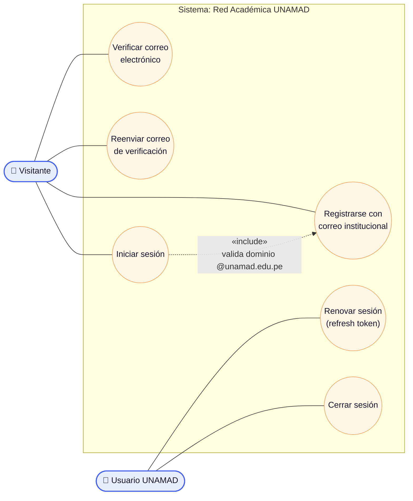
```mermaid
flowchart LR
    Visitante(["🧑 Visitante"])
    Usuario(["🧑 Usuario UNAMAD"])

    subgraph Sistema1["Sistema: Red Académica UNAMAD"]
        UC1_1(("Registrarse con<br/>correo institucional"))
        UC1_2(("Verificar correo<br/>electrónico"))
        UC1_3(("Reenviar correo<br/>de verificación"))
        UC1_4(("Iniciar sesión"))
        UC1_5(("Renovar sesión<br/>(refresh token)"))
        UC1_6(("Cerrar sesión"))
    end

    Visitante --- UC1_1
    Visitante --- UC1_2
    Visitante --- UC1_3
    Visitante --- UC1_4
    Usuario --- UC1_5
    Usuario --- UC1_6
    UC1_4 -.->|"«include»<br/>valida dominio @unamad.edu.pe"| UC1_1

    classDef actor fill:#e8eefc,stroke:#4361ee,stroke-width:2px,color:#14142b
    classDef usecase fill:#fef6e4,stroke:#f4a261,stroke-width:1px,color:#14142b
    class Visitante,Usuario actor
    class UC1_1,UC1_2,UC1_3,UC1_4,UC1_5,UC1_6 usecase
```

#### Perfil y red de seguidores

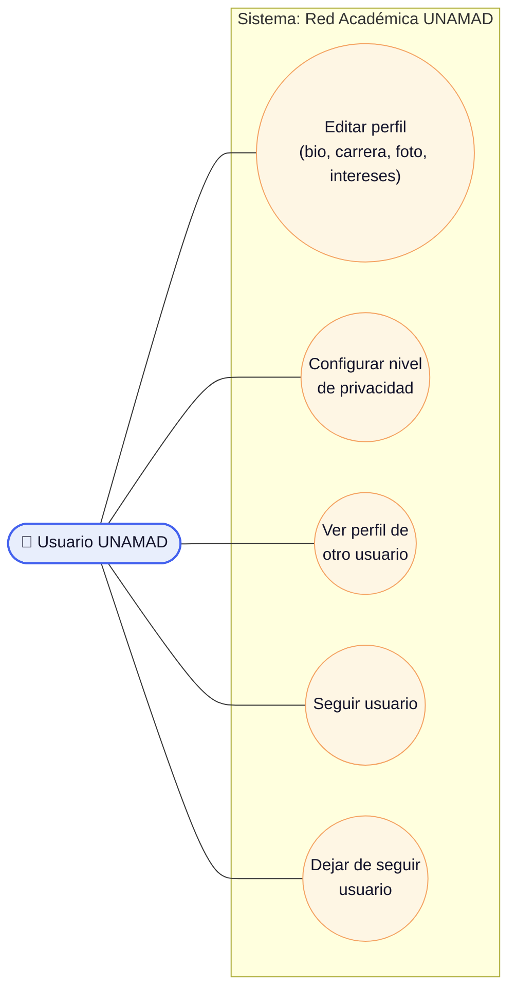
```mermaid
flowchart LR
    Usuario(["🧑 Usuario UNAMAD"])

    subgraph Sistema2["Sistema: Red Académica UNAMAD"]
        UC2_1(("Editar perfil<br/>(bio, carrera, foto, intereses)"))
        UC2_2(("Configurar nivel<br/>de privacidad"))
        UC2_3(("Ver perfil de<br/>otro usuario"))
        UC2_4(("Seguir usuario"))
        UC2_5(("Dejar de seguir<br/>usuario"))
    end

    Usuario --- UC2_1
    Usuario --- UC2_2
    Usuario --- UC2_3
    Usuario --- UC2_4
    Usuario --- UC2_5

    classDef actor fill:#e8eefc,stroke:#4361ee,stroke-width:2px,color:#14142b
    classDef usecase fill:#fef6e4,stroke:#f4a261,stroke-width:1px,color:#14142b
    class Usuario actor
    class UC2_1,UC2_2,UC2_3,UC2_4,UC2_5 usecase
```

#### Publicaciones y feed

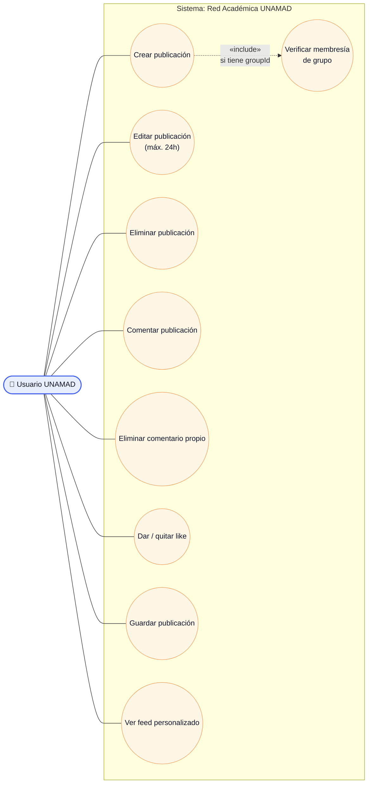
```mermaid
flowchart LR
    Usuario(["🧑 Usuario UNAMAD"])

    subgraph Sistema3["Sistema: Red Académica UNAMAD"]
        UC3_1(("Crear publicación"))
        UC3_2(("Editar publicación<br/>(máx. 24h)"))
        UC3_3(("Eliminar publicación"))
        UC3_4(("Comentar publicación"))
        UC3_5(("Eliminar comentario propio"))
        UC3_6(("Dar / quitar like"))
        UC3_7(("Guardar publicación"))
        UC3_8(("Ver feed personalizado"))
        UC3_9(("Verificar membresía<br/>de grupo"))
    end

    Usuario --- UC3_1
    Usuario --- UC3_2
    Usuario --- UC3_3
    Usuario --- UC3_4
    Usuario --- UC3_5
    Usuario --- UC3_6
    Usuario --- UC3_7
    Usuario --- UC3_8
    UC3_1 -.->|"«include»<br/>si tiene groupId"| UC3_9

    classDef actor fill:#e8eefc,stroke:#4361ee,stroke-width:2px,color:#14142b
    classDef usecase fill:#fef6e4,stroke:#f4a261,stroke-width:1px,color:#14142b
    class Usuario actor
    class UC3_1,UC3_2,UC3_3,UC3_4,UC3_5,UC3_6,UC3_7,UC3_8,UC3_9 usecase
```

#### Grupos de estudio

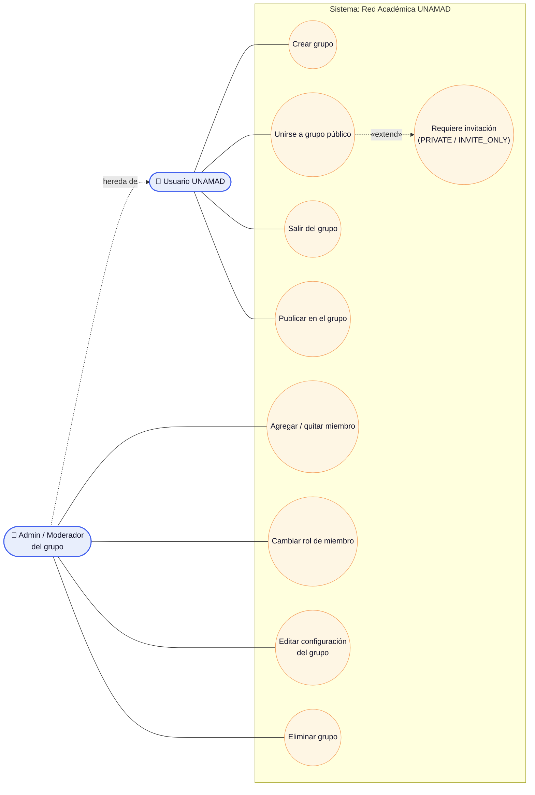
```mermaid
flowchart LR
    Usuario(["🧑 Usuario UNAMAD"])
    ModGrupo(["🧑 Admin / Moderador<br/>del grupo"])

    subgraph Sistema4["Sistema: Red Académica UNAMAD"]
        UC4_1(("Crear grupo"))
        UC4_2(("Unirse a grupo público"))
        UC4_3(("Salir del grupo"))
        UC4_4(("Publicar en el grupo"))
        UC4_5(("Requiere invitación<br/>(PRIVATE / INVITE_ONLY)"))
        UC4_6(("Agregar / quitar miembro"))
        UC4_7(("Cambiar rol de miembro"))
        UC4_8(("Editar configuración<br/>del grupo"))
        UC4_9(("Eliminar grupo"))
    end

    ModGrupo -.->|hereda de| Usuario
    Usuario --- UC4_1
    Usuario --- UC4_2
    Usuario --- UC4_3
    Usuario --- UC4_4
    UC4_2 -.->|"«extend»"| UC4_5
    ModGrupo --- UC4_6
    ModGrupo --- UC4_7
    ModGrupo --- UC4_8
    ModGrupo --- UC4_9

    classDef actor fill:#e8eefc,stroke:#4361ee,stroke-width:2px,color:#14142b
    classDef usecase fill:#fef6e4,stroke:#f4a261,stroke-width:1px,color:#14142b
    class Usuario,ModGrupo actor
    class UC4_1,UC4_2,UC4_3,UC4_4,UC4_5,UC4_6,UC4_7,UC4_8,UC4_9 usecase
```

*`ModGrupo` no es un rol del sistema (como `UserRole`), sino el rol `ADMIN`/`MODERATOR` dentro de `GroupMember` — cualquier `Usuario UNAMAD` puede llegar a serlo dentro de un grupo específico.*

#### Mensajería

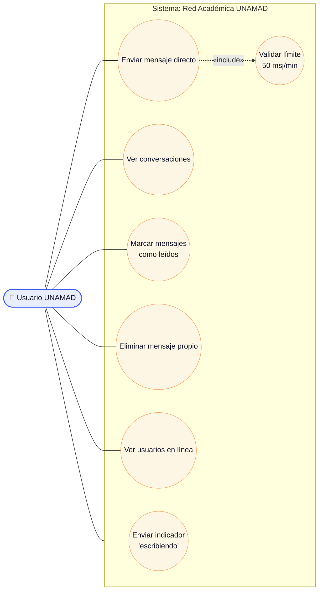
```mermaid
flowchart LR
    Usuario(["🧑 Usuario UNAMAD"])

    subgraph Sistema5["Sistema: Red Académica UNAMAD"]
        UC5_1(("Enviar mensaje directo"))
        UC5_2(("Ver conversaciones"))
        UC5_3(("Marcar mensajes<br/>como leídos"))
        UC5_4(("Eliminar mensaje propio"))
        UC5_5(("Ver usuarios en línea"))
        UC5_6(("Enviar indicador<br/>'escribiendo'"))
        UC5_7(("Validar límite<br/>50 msj/min"))
    end

    Usuario --- UC5_1
    Usuario --- UC5_2
    Usuario --- UC5_3
    Usuario --- UC5_4
    Usuario --- UC5_5
    Usuario --- UC5_6
    UC5_1 -.->|"«include»"| UC5_7

    classDef actor fill:#e8eefc,stroke:#4361ee,stroke-width:2px,color:#14142b
    classDef usecase fill:#fef6e4,stroke:#f4a261,stroke-width:1px,color:#14142b
    class Usuario actor
    class UC5_1,UC5_2,UC5_3,UC5_4,UC5_5,UC5_6,UC5_7 usecase
```

#### Eventos académicos

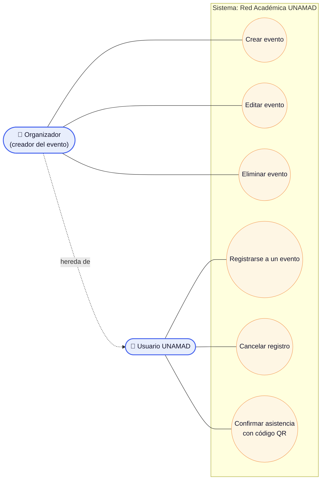
```mermaid
flowchart LR
    Usuario(["🧑 Usuario UNAMAD"])
    Organizador(["🧑 Organizador<br/>(creador del evento)"])

    subgraph Sistema6["Sistema: Red Académica UNAMAD"]
        UC6_1(("Crear evento"))
        UC6_2(("Editar evento"))
        UC6_3(("Eliminar evento"))
        UC6_4(("Registrarse a un evento"))
        UC6_5(("Cancelar registro"))
        UC6_6(("Confirmar asistencia<br/>con código QR"))
    end

    Organizador -.->|hereda de| Usuario
    Usuario --- UC6_4
    Usuario --- UC6_5
    Usuario --- UC6_6
    Organizador --- UC6_1
    Organizador --- UC6_2
    Organizador --- UC6_3

    classDef actor fill:#e8eefc,stroke:#4361ee,stroke-width:2px,color:#14142b
    classDef usecase fill:#fef6e4,stroke:#f4a261,stroke-width:1px,color:#14142b
    class Usuario,Organizador actor
    class UC6_1,UC6_2,UC6_3,UC6_4,UC6_5,UC6_6 usecase
```

#### Recursos académicos

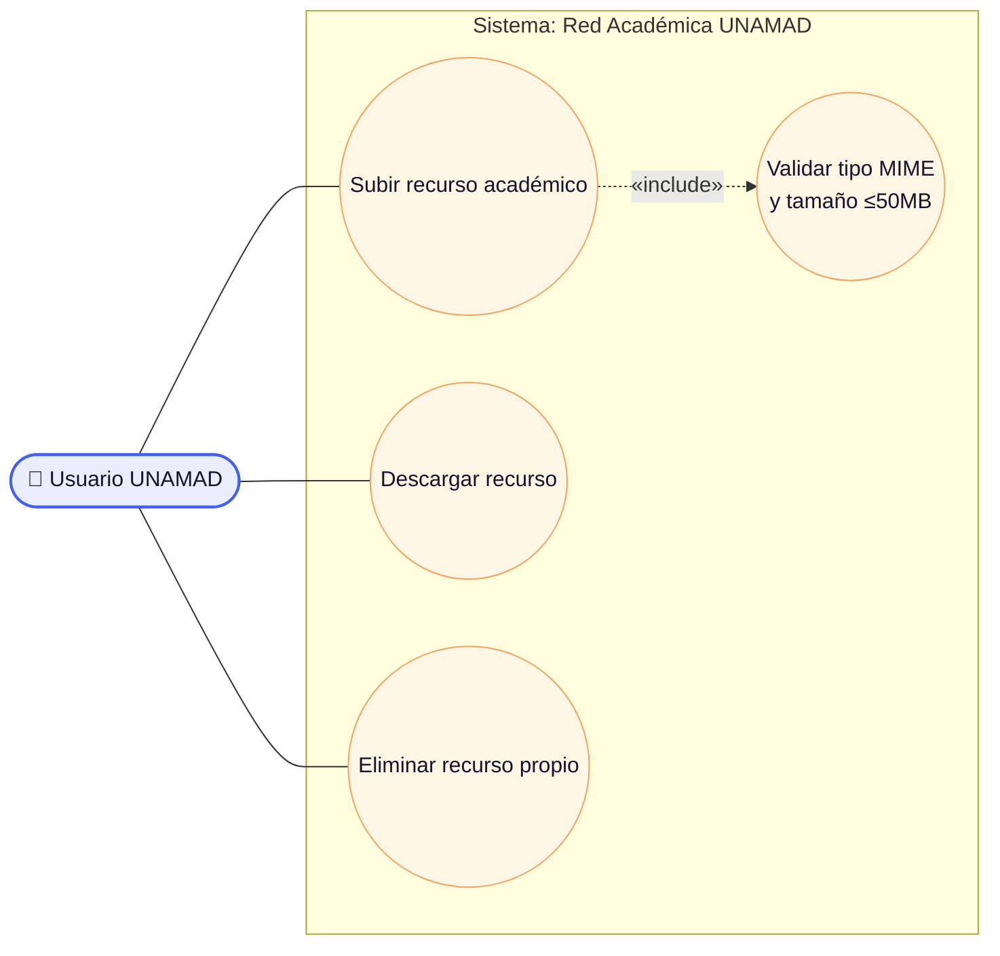
```mermaid
flowchart LR
    Usuario(["🧑 Usuario UNAMAD"])

    subgraph Sistema7["Sistema: Red Académica UNAMAD"]
        UC7_1(("Subir recurso académico"))
        UC7_2(("Descargar recurso"))
        UC7_3(("Eliminar recurso propio"))
        UC7_4(("Validar tipo MIME<br/>y tamaño ≤50MB"))
    end

    Usuario --- UC7_1
    Usuario --- UC7_2
    Usuario --- UC7_3
    UC7_1 -.->|"«include»"| UC7_4

    classDef actor fill:#e8eefc,stroke:#4361ee,stroke-width:2px,color:#14142b
    classDef usecase fill:#fef6e4,stroke:#f4a261,stroke-width:1px,color:#14142b
    class Usuario actor
    class UC7_1,UC7_2,UC7_3,UC7_4 usecase
```

#### Tutor académico con IA

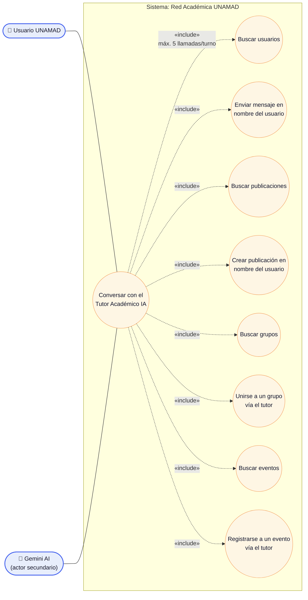
```mermaid
flowchart LR
    Usuario(["🧑 Usuario UNAMAD"])
    Gemini(["🤖 Gemini AI<br/>(actor secundario)"])

    subgraph Sistema8["Sistema: Red Académica UNAMAD"]
        UC8_1(("Conversar con el<br/>Tutor Académico IA"))
        UC8_2(("Buscar usuarios"))
        UC8_3(("Enviar mensaje en<br/>nombre del usuario"))
        UC8_4(("Buscar publicaciones"))
        UC8_5(("Crear publicación en<br/>nombre del usuario"))
        UC8_6(("Buscar grupos"))
        UC8_7(("Unirse a un grupo<br/>vía el tutor"))
        UC8_8(("Buscar eventos"))
        UC8_9(("Registrarse a un evento<br/>vía el tutor"))
    end

    Usuario --- UC8_1
    Gemini --- UC8_1
    UC8_1 -.->|"«include»<br/>máx. 5 llamadas/turno"| UC8_2
    UC8_1 -.->|"«include»"| UC8_3
    UC8_1 -.->|"«include»"| UC8_4
    UC8_1 -.->|"«include»"| UC8_5
    UC8_1 -.->|"«include»"| UC8_6
    UC8_1 -.->|"«include»"| UC8_7
    UC8_1 -.->|"«include»"| UC8_8
    UC8_1 -.->|"«include»"| UC8_9

    classDef actor fill:#e8eefc,stroke:#4361ee,stroke-width:2px,color:#14142b
    classDef usecase fill:#fef6e4,stroke:#f4a261,stroke-width:1px,color:#14142b
    class Usuario,Gemini actor
    class UC8_1,UC8_2,UC8_3,UC8_4,UC8_5,UC8_6,UC8_7,UC8_8,UC8_9 usecase
```

*Cada `«include»` corresponde a una función declarada en `gemini.service.ts` (`searchUsers`, `sendMessage`, `searchPosts`, `createPost`, `searchGroups`, `joinGroup`, `searchEvents`, `registerToEvent`) y queda registrada en `TutorActionLog`.*

#### Administración

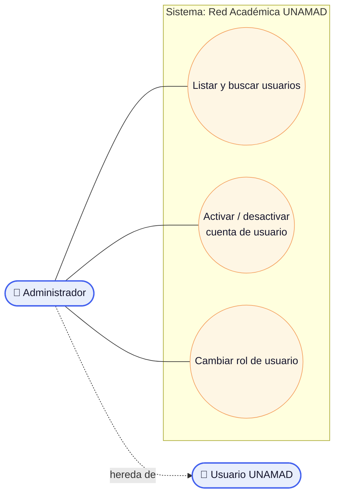
```mermaid
flowchart LR
    Usuario(["🧑 Usuario UNAMAD"])
    Admin(["🧑 Administrador"])

    subgraph Sistema9["Sistema: Red Académica UNAMAD"]
        UC9_1(("Listar y buscar usuarios"))
        UC9_2(("Activar / desactivar<br/>cuenta de usuario"))
        UC9_3(("Cambiar rol de usuario"))
    end

    Admin -.->|hereda de| Usuario
    Admin --- UC9_1
    Admin --- UC9_2
    Admin --- UC9_3

    classDef actor fill:#e8eefc,stroke:#4361ee,stroke-width:2px,color:#14142b
    classDef usecase fill:#fef6e4,stroke:#f4a261,stroke-width:1px,color:#14142b
    class Usuario,Admin actor
    class UC9_1,UC9_2,UC9_3 usecase
```

*`Administrador` es el rol `UserRole.ADMIN`, protegido con `@Roles(UserRole.ADMIN)` + `RolesGuard` en `admin.controller.ts`, y hereda todos los casos de uso de `Usuario UNAMAD` (puede publicar, unirse a grupos, etc., además de administrar).*

### Diagrama Entidad-Relación

Basado 1:1 en `backend/prisma/schema.prisma` (18 modelos). Aquí solo las relaciones — el detalle de columnas de cada tabla está más abajo, en el **diccionario de datos**, como texto normal (para poder hacer zoom y buscar con el navegador, algo que el diagrama en sí no permite).

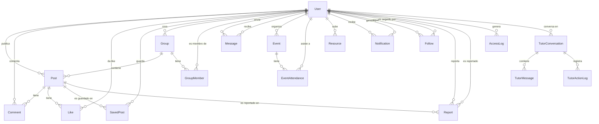
```mermaid
erDiagram
    User ||--o{ Post : "publica"
    User ||--o{ Comment : "comenta"
    User ||--o{ Like : "da like"
    User ||--o{ SavedPost : "guarda"
    User ||--o{ Group : "crea"
    User ||--o{ GroupMember : "es miembro de"
    User ||--o{ Message : "envia"
    User ||--o{ Message : "recibe"
    User ||--o{ Event : "organiza"
    User ||--o{ EventAttendance : "asiste a"
    User ||--o{ Resource : "sube"
    User ||--o{ Notification : "recibe"
    User ||--o{ Notification : "genera"
    User ||--o{ Follow : "sigue"
    User ||--o{ Follow : "es seguido por"
    User ||--o{ Report : "reporta"
    User ||--o{ Report : "es reportado"
    User ||--o{ AccessLog : "genera"
    User ||--o{ TutorConversation : "conversa en"

    Post ||--o{ Comment : "tiene"
    Post ||--o{ Like : "tiene"
    Post ||--o{ SavedPost : "es guardado en"
    Post ||--o{ Report : "es reportado en"
    Group ||--o{ Post : "contiene"
    Group ||--o{ GroupMember : "tiene"
    Event ||--o{ EventAttendance : "tiene"
    TutorConversation ||--o{ TutorMessage : "contiene"
    TutorConversation ||--o{ TutorActionLog : "registra"
```

#### Diccionario de datos

**Usuarios y autenticación**

`User`

| Campo | Tipo | Notas |
|---|---|---|
| id | string (PK) | UUID |
| email | string (UK) | dominio institucional `@unamad.edu.pe` |
| password | string | hash bcrypt, 12 rounds |
| firstName / lastName | string | |
| role | UserRole | STUDENT, PROFESSOR, ADMIN, ALUMNI |
| department / career | string | opcionales |
| profilePicture | string | opcional |
| bio | string | máximo 500 caracteres |
| interests | string[] | array de intereses académicos |
| privacyLevel | PrivacyLevel | PUBLIC, UNIVERSITY_ONLY, PRIVATE |
| isVerified / isActive | boolean | |
| verificationToken | string | opcional |
| resetPasswordToken / resetPasswordExpires | string / datetime | opcionales |
| refreshToken | string | hash bcrypt, opcional |
| createdAt / updatedAt | datetime | |

**Publicaciones e interacción social**

`Post`

| Campo | Tipo | Notas |
|---|---|---|
| id | string (PK) | UUID |
| authorId | string (FK → User) | |
| content | string | máximo 3000 caracteres |
| type | PostType | QUESTION, DISCUSSION, RESOURCE, EVENT, ANNOUNCEMENT |
| images | string[] | URLs, máximo 10 |
| likesCount / commentsCount | int | contadores desnormalizados |
| isEdited | boolean | editable solo dentro de 24h |
| groupId | string (FK → Group) | opcional, `null` = feed general |
| createdAt / updatedAt | datetime | |

`Comment`

| Campo | Tipo | Notas |
|---|---|---|
| id | string (PK) | UUID |
| postId | string (FK → Post) | |
| authorId | string (FK → User) | |
| content | string | máximo 1000 caracteres |
| createdAt / updatedAt | datetime | |

`Like` / `SavedPost`

| Campo | Tipo | Notas |
|---|---|---|
| id | string (PK) | UUID |
| postId | string (FK → Post) | |
| userId | string (FK → User) | único por (postId, userId) |
| createdAt | datetime | |

`Follow`

| Campo | Tipo | Notas |
|---|---|---|
| id | string (PK) | UUID |
| followerId | string (FK → User) | quien sigue |
| followingId | string (FK → User) | a quien sigue |
| createdAt | datetime | único por (followerId, followingId) |

**Grupos de estudio**

`Group`

| Campo | Tipo | Notas |
|---|---|---|
| id | string (PK) | UUID |
| name / description | string | |
| type | GroupType | PUBLIC, PRIVATE, INVITE_ONLY |
| creatorId | string (FK → User) | |
| membersCount | int | máximo 100 |
| coverImage | string | opcional |
| createdAt / updatedAt | datetime | |

`GroupMember`

| Campo | Tipo | Notas |
|---|---|---|
| id | string (PK) | UUID |
| groupId | string (FK → Group) | |
| userId | string (FK → User) | único por (groupId, userId) |
| role | GroupMemberRole | ADMIN, MODERATOR, MEMBER |
| joinedAt | datetime | |

**Mensajería**

`Message`

| Campo | Tipo | Notas |
|---|---|---|
| id | string (PK) | UUID |
| senderId / receiverId | string (FK → User) | |
| content | string | máximo 1000 caracteres |
| isRead | boolean | |
| createdAt | datetime | |

**Eventos académicos**

`Event`

| Campo | Tipo | Notas |
|---|---|---|
| id | string (PK) | UUID |
| title / description | string | |
| organizerId | string (FK → User) | |
| startDate / endDate | datetime | |
| location | string | opcional |
| maxAttendees | int | default 500 |
| isOnline | boolean | |
| qrCode | string | código único generado al crear |
| coverImage | string | opcional |
| createdAt / updatedAt | datetime | |

`EventAttendance`

| Campo | Tipo | Notas |
|---|---|---|
| id | string (PK) | UUID |
| eventId | string (FK → Event) | |
| userId | string (FK → User) | único por (eventId, userId) |
| confirmed | boolean | `true` tras validar el QR |
| createdAt | datetime | |

**Recursos académicos**

`Resource`

| Campo | Tipo | Notas |
|---|---|---|
| id | string (PK) | UUID |
| uploaderId | string (FK → User) | |
| title / description | string | description opcional |
| fileUrl / fileType | string | |
| fileSize | int | bytes, máximo 50MB |
| downloadCount | int | |
| createdAt / updatedAt | datetime | |

**Notificaciones y moderación**

`Notification`

| Campo | Tipo | Notas |
|---|---|---|
| id | string (PK) | UUID |
| recipientId | string (FK → User) | |
| senderId | string (FK → User) | opcional |
| type / title / message | string | |
| isRead | boolean | |
| link | string | opcional |
| createdAt | datetime | |

`Report` *(modelo en el esquema, sin controlador/servicio implementado — ver nota de honestidad técnica)*

| Campo | Tipo | Notas |
|---|---|---|
| id | string (PK) | UUID |
| reporterId | string (FK → User) | |
| reportedUserId / postId | string (FK) | ambos opcionales |
| reason / description | string | description opcional |
| status | string | `pending` por defecto |
| createdAt / updatedAt | datetime | |

**Auditoría**

`AccessLog`

| Campo | Tipo | Notas |
|---|---|---|
| id | string (PK) | UUID |
| userId | string (FK → User) | |
| ipAddress / userAgent | string | |
| device / browser / os | string | opcionales |
| country / city | string | opcionales |
| success | boolean | |
| failReason | string | opcional |
| createdAt | datetime | |

**Tutor académico con IA**

`TutorConversation`

| Campo | Tipo | Notas |
|---|---|---|
| id | string (PK) | UUID |
| userId | string (FK → User) | |
| title | string | opcional |
| createdAt / updatedAt | datetime | |

`TutorMessage`

| Campo | Tipo | Notas |
|---|---|---|
| id | string (PK) | UUID |
| conversationId | string (FK → TutorConversation) | |
| role | string | `user` o `assistant` |
| content | string | |
| createdAt | datetime | |

`TutorActionLog`

| Campo | Tipo | Notas |
|---|---|---|
| id | string (PK) | UUID |
| conversationId | string (FK → TutorConversation) | |
| functionName | string | p. ej. `searchUsers`, `sendMessage` |
| parameters / result | string | JSON serializado |
| success | boolean | |
| createdAt | datetime | |

### Diagramas de Flujo

#### Autenticación completa (registro → verificación → login → refresh)

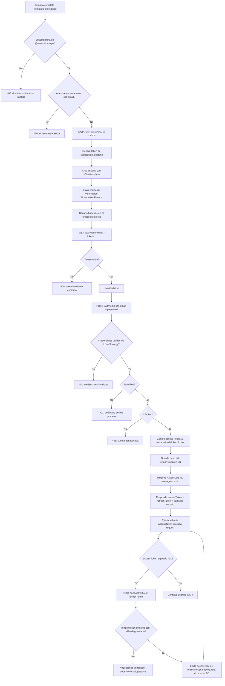
```mermaid
flowchart TD
    A[Usuario completa formulario de registro] --> B{Email termina en @unamad.edu.pe?}
    B -->|No| B1[400: dominio institucional invalido]
    B -->|Si| C{Ya existe un usuario con ese email?}
    C -->|Si| C1[400: el usuario ya existe]
    C -->|No| D[bcrypt.hash password, 12 rounds]
    D --> E[Genera token de verificacion aleatorio]
    E --> F[Crea usuario con isVerified=false]
    F --> G[Envia correo de verificacion Nodemailer/Resend]
    G --> H[Usuario hace clic en el enlace del correo]
    H --> I[GET /auth/verify-email?token=...]
    I --> J{Token valido?}
    J -->|No| J1[400: token invalido o expirado]
    J -->|Si| K[isVerified=true]
    K --> L[POST /auth/login con email y password]
    L --> M{Credenciales validas via LocalStrategy?}
    M -->|No| M1[401: credenciales invalidas]
    M -->|Si| N{isVerified?}
    N -->|No| N1[401: verifica tu correo primero]
    N -->|Si| O{isActive?}
    O -->|No| O1[401: cuenta desactivada]
    O -->|Si| P[Genera accessToken 15 min + refreshToken 7 dias]
    P --> Q[Guarda hash del refreshToken en BD]
    Q --> R[Registra AccessLog: ip, userAgent, exito]
    R --> S[Responde accessToken + refreshToken + datos de usuario]
    S --> T[Cliente adjunta accessToken en cada request]
    T --> U{accessToken expirado 401?}
    U -->|Si| V[POST /auth/refresh con refreshToken]
    V --> W{refreshToken coincide con el hash guardado?}
    W -->|No| W1[401: acceso denegado, debe volver a loguearse]
    W -->|Si| X[Emite accessToken y refreshToken nuevos, rota el hash en BD]
    X --> T
    U -->|No| Y[Continua usando la API]
```

**Notas de seguridad aplicadas en este flujo** (ver `auth.controller.ts`): `register` limitado a 3 intentos/segundo, `login` a 5 intentos/minuto, `refresh` a 10/minuto y `resend-verification` a 3/minuto — todo vía `@Throttle` de `@nestjs/throttler`, además del rate limit global de 100 req/min por IP.

#### Publicaciones y feed

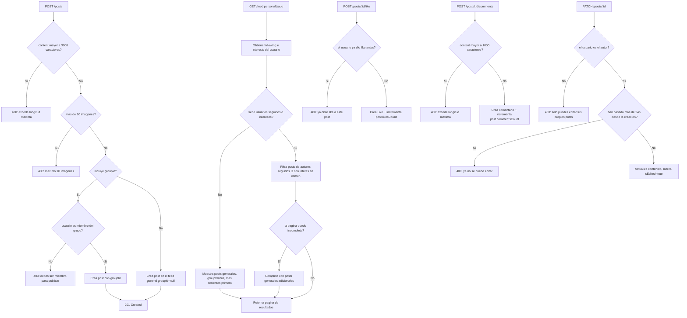
```mermaid
flowchart TD
    A[POST /posts] --> B{content mayor a 3000 caracteres?}
    B -->|Si| B1[400: excede longitud maxima]
    B -->|No| C{mas de 10 imagenes?}
    C -->|Si| C1[400: maximo 10 imagenes]
    C -->|No| D{incluye groupId?}
    D -->|Si| E{usuario es miembro del grupo?}
    E -->|No| E1[403: debes ser miembro para publicar]
    E -->|Si| F[Crea post con groupId]
    D -->|No| G[Crea post en el feed general groupId=null]
    F --> H[201 Created]
    G --> H

    I[GET /feed personalizado] --> J[Obtiene following e interests del usuario]
    J --> K{tiene usuarios seguidos o intereses?}
    K -->|No| L[Muestra posts generales, groupId=null, mas recientes primero]
    K -->|Si| M[Filtra posts de autores seguidos O con interes en comun]
    M --> N{la pagina quedo incompleta?}
    N -->|Si| O[Completa con posts generales adicionales]
    N -->|No| P[Retorna pagina de resultados]
    O --> P
    L --> P

    Q[POST /posts/:id/like] --> R{el usuario ya dio like antes?}
    R -->|Si| R1[400: ya diste like a este post]
    R -->|No| S[Crea Like + incrementa post.likesCount]

    T[POST /posts/:id/comments] --> U{content mayor a 1000 caracteres?}
    U -->|Si| U1[400: excede longitud maxima]
    U -->|No| V[Crea comentario + incrementa post.commentsCount]

    W[PATCH /posts/:id] --> X{el usuario es el autor?}
    X -->|No| X1[403: solo puedes editar tus propios posts]
    X -->|Si| Y{han pasado mas de 24h desde la creacion?}
    Y -->|Si| Y1[400: ya no se puede editar]
    Y -->|No| Z[Actualiza contenido, marca isEdited=true]
```

#### Tutor académico con IA (Gemini)

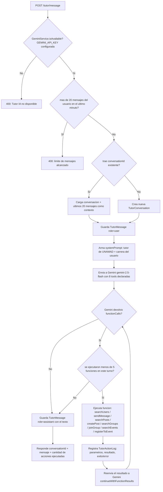
```mermaid
flowchart TD
    A[POST /tutor/message] --> B{GeminiService.isAvailable? GEMINI_API_KEY configurada}
    B -->|No| B1[400: Tutor IA no disponible]
    B -->|Si| C{mas de 20 mensajes del usuario en el ultimo minuto?}
    C -->|Si| C1[400: limite de mensajes alcanzado]
    C -->|No| D{trae conversationId existente?}
    D -->|Si| E[Carga conversacion + ultimos 20 mensajes como contexto]
    D -->|No| F[Crea nueva TutorConversation]
    E --> G[Guarda TutorMessage role=user]
    F --> G
    G --> H[Arma systemPrompt: tutor de UNAMAD + carrera del usuario]
    H --> I[Envia a Gemini gemini-2.5-flash con 8 tools declaradas]
    I --> J{Gemini devolvio functionCalls?}
    J -->|No| K[Guarda TutorMessage role=assistant con el texto]
    J -->|Si| L{se ejecutaron menos de 5 funciones en este turno?}
    L -->|No| K
    L -->|Si| M["Ejecuta funcion: searchUsers / sendMessage / searchPosts /\ncreatePost / searchGroups / joinGroup / searchEvents / registerToEvent"]
    M --> N[Registra TutorActionLog: parametros, resultado, exito/error]
    N --> O[Reenvia el resultado a Gemini continueWithFunctionResults]
    O --> J
    K --> P[Responde conversationId + mensaje + cantidad de acciones ejecutadas]
```

#### Eventos y confirmación por QR

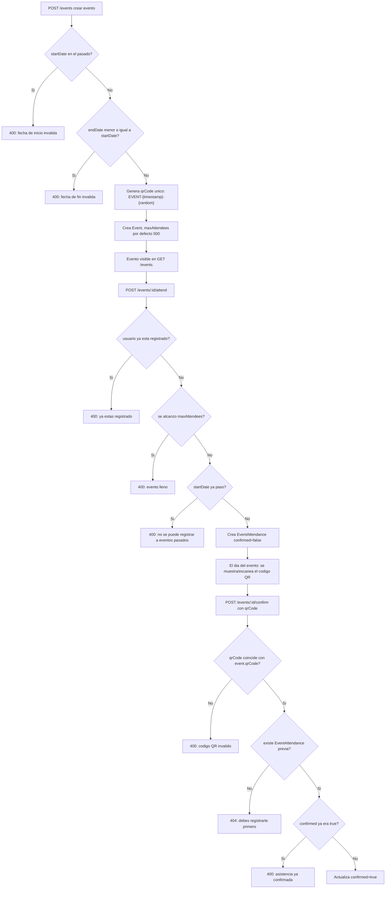
```mermaid
flowchart TD
    A[POST /events crear evento] --> B{startDate en el pasado?}
    B -->|Si| B1[400: fecha de inicio invalida]
    B -->|No| C{endDate menor o igual a startDate?}
    C -->|Si| C1[400: fecha de fin invalida]
    C -->|No| D["Genera qrCode unico: EVENT-{timestamp}-{random}"]
    D --> E[Crea Event, maxAttendees por defecto 500]
    E --> F[Evento visible en GET /events]

    F --> G[POST /events/:id/attend]
    G --> H{usuario ya esta registrado?}
    H -->|Si| H1[400: ya estas registrado]
    H -->|No| I{se alcanzo maxAttendees?}
    I -->|Si| I1[400: evento lleno]
    I -->|No| J{startDate ya paso?}
    J -->|Si| J1[400: no se puede registrar a eventos pasados]
    J -->|No| K[Crea EventAttendance confirmed=false]

    K --> L[El dia del evento: se muestra/escanea el codigo QR]
    L --> M[POST /events/:id/confirm con qrCode]
    M --> N{qrCode coincide con event.qrCode?}
    N -->|No| N1[400: codigo QR invalido]
    N -->|Si| O{existe EventAttendance previa?}
    O -->|No| O1[404: debes registrarte primero]
    O -->|Si| P{confirmed ya era true?}
    P -->|Si| P1[400: asistencia ya confirmada]
    P -->|No| Q[Actualiza confirmed=true]
```

### Diagramas de Secuencia

#### Registro y verificación de correo institucional

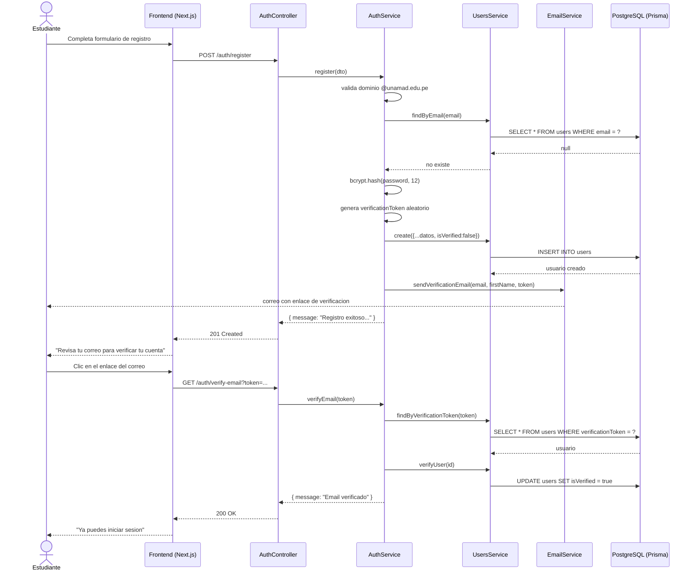
```mermaid
sequenceDiagram
    actor Est as Estudiante
    participant FE as Frontend (Next.js)
    participant AC as AuthController
    participant AS as AuthService
    participant US as UsersService
    participant EM as EmailService
    participant DB as PostgreSQL (Prisma)

    Est->>FE: Completa formulario de registro
    FE->>AC: POST /auth/register
    AC->>AS: register(dto)
    AS->>AS: valida dominio @unamad.edu.pe
    AS->>US: findByEmail(email)
    US->>DB: SELECT * FROM users WHERE email = ?
    DB-->>US: null
    US-->>AS: no existe
    AS->>AS: bcrypt.hash(password, 12)
    AS->>AS: genera verificationToken aleatorio
    AS->>US: create({...datos, isVerified:false})
    US->>DB: INSERT INTO users
    DB-->>US: usuario creado
    AS->>EM: sendVerificationEmail(email, firstName, token)
    EM-->>Est: correo con enlace de verificacion
    AS-->>AC: { message: "Registro exitoso..." }
    AC-->>FE: 201 Created
    FE-->>Est: "Revisa tu correo para verificar tu cuenta"

    Est->>FE: Clic en el enlace del correo
    FE->>AC: GET /auth/verify-email?token=...
    AC->>AS: verifyEmail(token)
    AS->>US: findByVerificationToken(token)
    US->>DB: SELECT * FROM users WHERE verificationToken = ?
    DB-->>US: usuario
    AS->>US: verifyUser(id)
    US->>DB: UPDATE users SET isVerified = true
    AS-->>AC: { message: "Email verificado" }
    AC-->>FE: 200 OK
    FE-->>Est: "Ya puedes iniciar sesion"
```

#### Login y renovación de tokens (JWT + refresh)

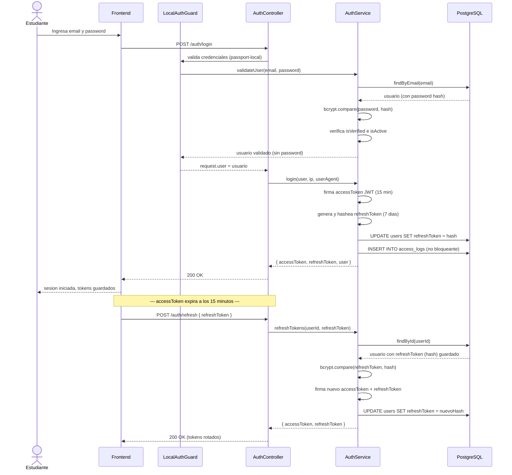
```mermaid
sequenceDiagram
    actor Est as Estudiante
    participant FE as Frontend
    participant LG as LocalAuthGuard
    participant AC as AuthController
    participant AS as AuthService
    participant DB as PostgreSQL

    Est->>FE: Ingresa email y password
    FE->>AC: POST /auth/login
    AC->>LG: valida credenciales (passport-local)
    LG->>AS: validateUser(email, password)
    AS->>DB: findByEmail(email)
    DB-->>AS: usuario (con password hash)
    AS->>AS: bcrypt.compare(password, hash)
    AS->>AS: verifica isVerified e isActive
    AS-->>LG: usuario validado (sin password)
    LG-->>AC: request.user = usuario
    AC->>AS: login(user, ip, userAgent)
    AS->>AS: firma accessToken JWT (15 min)
    AS->>AS: genera y hashea refreshToken (7 dias)
    AS->>DB: UPDATE users SET refreshToken = hash
    AS->>DB: INSERT INTO access_logs (no bloqueante)
    AS-->>AC: { accessToken, refreshToken, user }
    AC-->>FE: 200 OK
    FE-->>Est: sesion iniciada, tokens guardados

    Note over FE,AC: --- accessToken expira a los 15 minutos ---
    FE->>AC: POST /auth/refresh { refreshToken }
    AC->>AS: refreshTokens(userId, refreshToken)
    AS->>DB: findById(userId)
    DB-->>AS: usuario con refreshToken (hash) guardado
    AS->>AS: bcrypt.compare(refreshToken, hash)
    AS->>AS: firma nuevo accessToken + refreshToken
    AS->>DB: UPDATE users SET refreshToken = nuevoHash
    AS-->>AC: { accessToken, refreshToken }
    AC-->>FE: 200 OK (tokens rotados)
```

#### Publicar, dar like y comentar

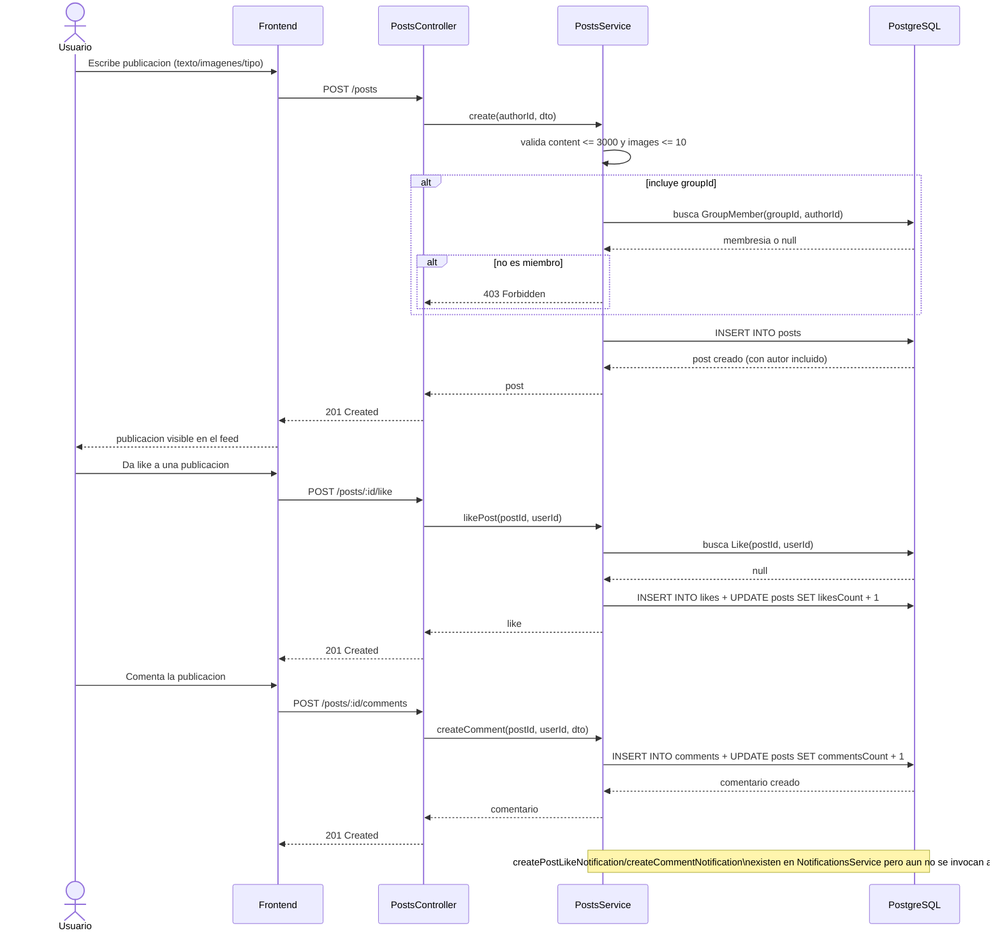
```mermaid
sequenceDiagram
    actor U as Usuario
    participant FE as Frontend
    participant PC as PostsController
    participant PS as PostsService
    participant DB as PostgreSQL

    U->>FE: Escribe publicacion (texto/imagenes/tipo)
    FE->>PC: POST /posts
    PC->>PS: create(authorId, dto)
    PS->>PS: valida content <= 3000 y images <= 10
    alt incluye groupId
        PS->>DB: busca GroupMember(groupId, authorId)
        DB-->>PS: membresia o null
        alt no es miembro
            PS-->>PC: 403 Forbidden
        end
    end
    PS->>DB: INSERT INTO posts
    DB-->>PS: post creado (con autor incluido)
    PS-->>PC: post
    PC-->>FE: 201 Created
    FE-->>U: publicacion visible en el feed

    U->>FE: Da like a una publicacion
    FE->>PC: POST /posts/:id/like
    PC->>PS: likePost(postId, userId)
    PS->>DB: busca Like(postId, userId)
    DB-->>PS: null
    PS->>DB: INSERT INTO likes + UPDATE posts SET likesCount + 1
    PS-->>PC: like
    PC-->>FE: 201 Created

    U->>FE: Comenta la publicacion
    FE->>PC: POST /posts/:id/comments
    PC->>PS: createComment(postId, userId, dto)
    PS->>DB: INSERT INTO comments + UPDATE posts SET commentsCount + 1
    DB-->>PS: comentario creado
    PS-->>PC: comentario
    PC-->>FE: 201 Created

    Note over PS,DB: createPostLikeNotification/createCommentNotification\nexisten en NotificationsService pero aun no se invocan aqui
```

#### Mensajería en tiempo real (WebSockets)

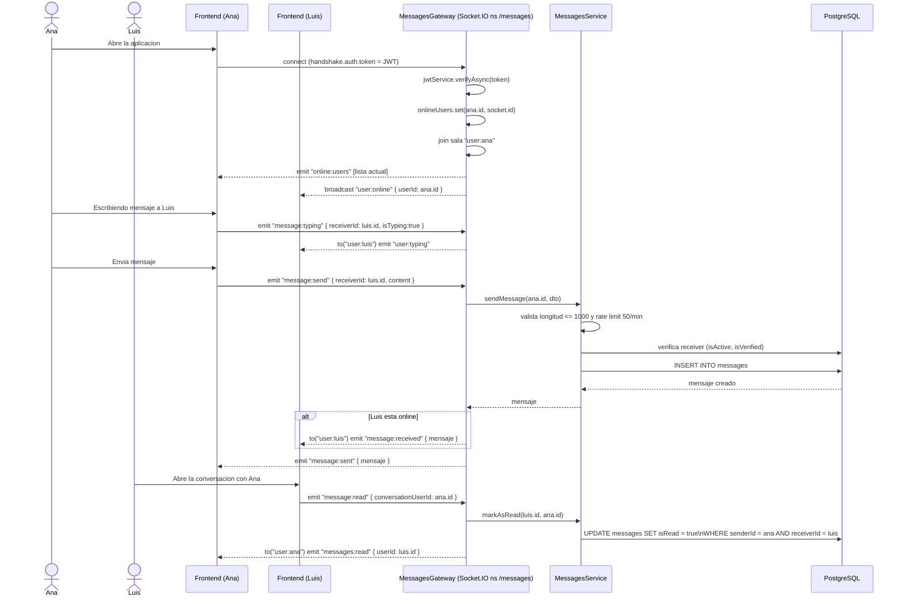
```mermaid
sequenceDiagram
    actor Ana
    actor Luis
    participant FEA as Frontend (Ana)
    participant FEL as Frontend (Luis)
    participant GW as MessagesGateway (Socket.IO ns /messages)
    participant MS as MessagesService
    participant DB as PostgreSQL

    Ana->>FEA: Abre la aplicacion
    FEA->>GW: connect (handshake.auth.token = JWT)
    GW->>GW: jwtService.verifyAsync(token)
    GW->>GW: onlineUsers.set(ana.id, socket.id)
    GW->>GW: join sala "user:ana"
    GW-->>FEA: emit "online:users" [lista actual]
    GW-->>FEL: broadcast "user:online" { userId: ana.id }

    Ana->>FEA: Escribiendo mensaje a Luis
    FEA->>GW: emit "message:typing" { receiverId: luis.id, isTyping:true }
    GW-->>FEL: to("user:luis") emit "user:typing"

    Ana->>FEA: Envia mensaje
    FEA->>GW: emit "message:send" { receiverId: luis.id, content }
    GW->>MS: sendMessage(ana.id, dto)
    MS->>MS: valida longitud <= 1000 y rate limit 50/min
    MS->>DB: verifica receiver (isActive, isVerified)
    MS->>DB: INSERT INTO messages
    DB-->>MS: mensaje creado
    MS-->>GW: mensaje
    alt Luis esta online
        GW-->>FEL: to("user:luis") emit "message:received" { mensaje }
    end
    GW-->>FEA: emit "message:sent" { mensaje }

    Luis->>FEL: Abre la conversacion con Ana
    FEL->>GW: emit "message:read" { conversationUserId: ana.id }
    GW->>MS: markAsRead(luis.id, ana.id)
    MS->>DB: UPDATE messages SET isRead = true\nWHERE senderId = ana AND receiverId = luis
    GW-->>FEA: to("user:ana") emit "messages:read" { userId: luis.id }
```

#### Unirse a un grupo de estudio

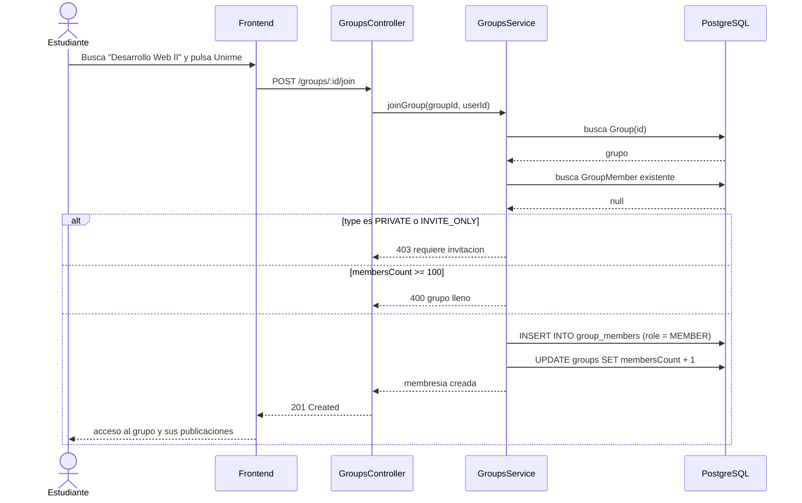
```mermaid
sequenceDiagram
    actor Est as Estudiante
    participant FE as Frontend
    participant GC as GroupsController
    participant GS as GroupsService
    participant DB as PostgreSQL

    Est->>FE: Busca "Desarrollo Web II" y pulsa Unirme
    FE->>GC: POST /groups/:id/join
    GC->>GS: joinGroup(groupId, userId)
    GS->>DB: busca Group(id)
    DB-->>GS: grupo
    GS->>DB: busca GroupMember existente
    DB-->>GS: null
    alt type es PRIVATE o INVITE_ONLY
        GS-->>GC: 403 requiere invitacion
    else membersCount >= 100
        GS-->>GC: 400 grupo lleno
    else
        GS->>DB: INSERT INTO group_members (role = MEMBER)
        GS->>DB: UPDATE groups SET membersCount + 1
        GS-->>GC: membresia creada
        GC-->>FE: 201 Created
        FE-->>Est: acceso al grupo y sus publicaciones
    end
```

#### Evento con confirmación de asistencia por QR

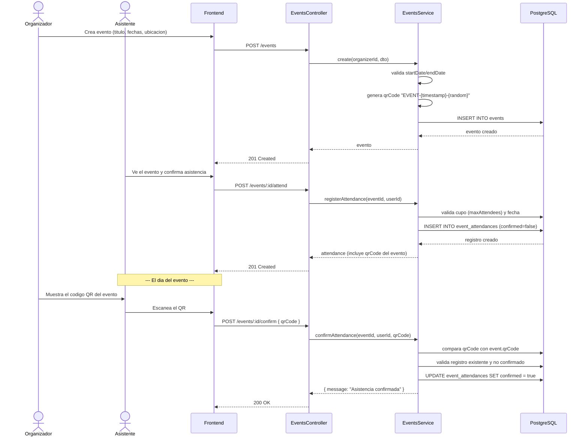
```mermaid
sequenceDiagram
    actor Org as Organizador
    actor As as Asistente
    participant FE as Frontend
    participant EC as EventsController
    participant ES as EventsService
    participant DB as PostgreSQL

    Org->>FE: Crea evento (titulo, fechas, ubicacion)
    FE->>EC: POST /events
    EC->>ES: create(organizerId, dto)
    ES->>ES: valida startDate/endDate
    ES->>ES: genera qrCode "EVENT-{timestamp}-{random}"
    ES->>DB: INSERT INTO events
    DB-->>ES: evento creado
    ES-->>EC: evento
    EC-->>FE: 201 Created

    As->>FE: Ve el evento y confirma asistencia
    FE->>EC: POST /events/:id/attend
    EC->>ES: registerAttendance(eventId, userId)
    ES->>DB: valida cupo (maxAttendees) y fecha
    ES->>DB: INSERT INTO event_attendances (confirmed=false)
    DB-->>ES: registro creado
    ES-->>EC: attendance (incluye qrCode del evento)
    EC-->>FE: 201 Created

    Note over As,FE: --- El dia del evento ---
    Org->>As: Muestra el codigo QR del evento
    As->>FE: Escanea el QR
    FE->>EC: POST /events/:id/confirm { qrCode }
    EC->>ES: confirmAttendance(eventId, userId, qrCode)
    ES->>DB: compara qrCode con event.qrCode
    ES->>DB: valida registro existente y no confirmado
    ES->>DB: UPDATE event_attendances SET confirmed = true
    ES-->>EC: { message: "Asistencia confirmada" }
    EC-->>FE: 200 OK
```

#### Conversación con el Tutor IA (function calling)

```mermaid
sequenceDiagram
    actor Est as Estudiante
    participant FE as Frontend
    participant TC as TutorController
    participant TS as TutorService
    participant GS as GeminiService
    participant Gem as Google Gemini API
    participant DB as PostgreSQL

    Est->>FE: "Buscame a alguien de Ing. de Sistemas y enviale un mensaje"
    FE->>TC: POST /tutor/message
    TC->>TS: sendMessage(userId, dto)
    TS->>TS: verifica geminiService.isAvailable()
    TS->>DB: cuenta mensajes del usuario en el ultimo minuto (limite 20)
    TS->>DB: crea o recupera TutorConversation + ultimos 20 mensajes
    TS->>DB: guarda TutorMessage (role=user)
    TS->>GS: chat(mensaje, historial, systemPrompt con carrera)
    GS->>Gem: startChat + sendMessage (8 tools declaradas)
    Gem-->>GS: functionCalls: [searchUsers{career:"Ing. Sistemas"}]
    GS-->>TS: { functionCalls }

    TS->>TS: executeFunction("searchUsers", args)
    TS->>DB: SELECT users WHERE career ILIKE ...
    DB-->>TS: lista de usuarios
    TS->>DB: INSERT INTO tutor_action_logs (searchUsers)
    TS->>GS: continueWithFunctionResults(...)
    GS->>Gem: envia functionResponse
    Gem-->>GS: functionCalls: [sendMessage{userId, content}]
    GS-->>TS: { functionCalls }

    TS->>TS: executeFunction("sendMessage", args)
    TS->>DB: INSERT INTO messages (mensaje directo en nombre del usuario)
    TS->>DB: INSERT INTO tutor_action_logs (sendMessage)
    TS->>GS: continueWithFunctionResults(...)
    GS->>Gem: envia functionResponse
    Gem-->>GS: { text: "Listo, le escribi a Juan..." }
    GS-->>TS: { text }

    TS->>DB: guarda TutorMessage (role=assistant)
    TS-->>TC: { conversationId, message, actionsExecuted: 2 }
    TC-->>FE: 200 OK
    FE-->>Est: muestra la respuesta del tutor
```

*(el ciclo `executeFunction → continueWithFunctionResults` se repite hasta 5 veces por turno — `MAX_FUNCTION_CALLS` en `tutor.service.ts` — antes de forzar una respuesta de texto)*

#### Subida de un recurso académico

```mermaid
sequenceDiagram
    actor U as Usuario
    participant FE as Frontend
    participant RC as ResourcesController
    participant MU as Multer (FileInterceptor)
    participant RS as ResourcesService
    participant DB as PostgreSQL
    participant FS as Disco (/uploads)

    U->>FE: Selecciona archivo (PDF/DOCX/PPTX/imagen/zip) y titulo
    FE->>RC: POST /resources/upload (multipart/form-data)
    RC->>MU: intercepta el archivo
    MU->>MU: fileFilter valida mimetype permitido
    alt mimetype no permitido
        MU-->>FE: 400 tipo de archivo no permitido
    else tamano mayor a 50MB
        MU-->>FE: 400 archivo excede el limite
    else valido
        MU->>FS: guarda archivo con nombre unico
        MU-->>RC: file { filename, size, ... }
        RC->>RS: create(userId, { title, fileUrl, fileType, fileSize })
        RS->>DB: INSERT INTO resources
        DB-->>RS: recurso creado
        RS-->>RC: recurso
        RC-->>FE: 201 Created
    end

    U->>FE: Descarga el recurso
    FE->>RC: PATCH /resources/:id/download
    RC->>RS: incrementDownload(id)
    RS->>DB: UPDATE resources SET downloadCount + 1
    FE-->>U: inicia la descarga del archivo
```

## 🚀 Stack Tecnológico

### Backend
- **Framework**: NestJS 11 + TypeScript
- **Base de datos**: PostgreSQL 16 + Prisma ORM
- **Tiempo real**: Socket.IO (`@nestjs/websockets`)
- **Autenticación**: JWT + Passport + Refresh Tokens
- **IA**: Google Generative AI (Gemini) para el tutor académico
- **Validación**: class-validator + class-transformer
- **Email**: Nodemailer / Resend
- **Documentación**: Swagger/OpenAPI
- **Seguridad**: Helmet, Throttler (rate limiting), bcrypt

### Frontend
- **Framework**: Next.js 16 (App Router) + React 19 + TypeScript
- **Estilos/UI**: Tailwind CSS 4 + shadcn/ui (Radix UI) + next-themes (modo oscuro)
- **Estado**: Zustand + TanStack React Query
- **Formularios**: React Hook Form + Zod
- **Tiempo real**: socket.io-client
- **Seguridad**: DOMPurify / isomorphic-dompurify para sanitización de contenido

### Calidad y DevOps
- **Testing backend**: Jest (unitarios + e2e), umbral de cobertura configurado (80%)
- **Testing frontend**: Vitest + Testing Library, Cypress (E2E)
- **Pruebas de carga**: Apache JMeter (`jmeter-tests/`)
- **Análisis estático**: SonarCloud, ESLint (reglas de seguridad), Prettier
- **CI/CD**: GitHub Actions (lint, tests, build, Docker, escaneo de vulnerabilidades con Trivy)
- **Contenedores**: Docker + Docker Compose

## 📦 Instalación y Configuración

### Prerrequisitos

- Node.js 18 o superior
- Docker y Docker Compose
- Git

### Backend

```bash
git clone https://github.com/Jose27luis/red-social.git
cd red-social/backend
cp .env.example .env      # edita las variables (DB, JWT, SMTP, dominio institucional, etc.)
docker-compose up -d      # levanta PostgreSQL (y el backend si aplica)
npm install
npm run prisma:generate
npm run prisma:migrate
npm run start:dev
```

El servidor estará disponible en `http://localhost:3001` y la documentación de la API (Swagger) en `http://localhost:3001/api/docs`.

### Frontend

```bash
cd red-social/frontend
# Crea .env.local con al menos:
#   NEXT_PUBLIC_API_URL=http://localhost:3001
#   NEXT_PUBLIC_APP_NAME=Red Académica UNAMAD
#   NEXT_PUBLIC_UNIVERSIDAD_DOMAIN=@unamad.edu.pe
npm install
npm run dev
```

El frontend estará disponible en `http://localhost:3002` (requiere el backend corriendo).

## 📚 Documentación

- [Backend](./backend/README.md) — detalle de la API NestJS
- [Frontend](./frontend/README.md) — detalle de la app Next.js
- [Arquitectura del sistema](./arquitectura.md)
- [Especificaciones y restricciones del proyecto](./proyecto.md)
- [Esquema del proyecto de Calidad de Software](./Esquema_Proyecto_Calidad_Sw-1-PARTE.md) — contexto del curso, FODA y justificación institucional
- [Configuración de seguridad](./SECURITY_SETUP.md)
- [Cuadro de pruebas](./CUADRO_PRUEBAS_COMPLETO.md) — estado de cobertura de pruebas por categoría
- [Pruebas de carga (JMeter)](./jmeter-tests/README.md)

## 🧪 Testing

```bash
# Backend
cd backend
npm run test        # unitarios
npm run test:cov    # con cobertura
npm run test:e2e    # integración

# Frontend
cd frontend
npm run test         # unitarios (Vitest)
npm run test:coverage
npm run e2e           # end-to-end (Cypress)
```

El [cuadro de pruebas](./CUADRO_PRUEBAS_COMPLETO.md) documenta qué casos de seguridad, funcionales y E2E están implementados y cuáles siguen pendientes — es un proyecto en desarrollo activo, no un sistema cerrado.

## 🔐 Seguridad

- JWT con tokens de acceso (15 min) y refresh tokens (7 días)
- Verificación de correo institucional antes de activar la cuenta
- Rate limiting (100 peticiones/min por IP) y throttling específico en endpoints sensibles (p. ej. tutor IA: 20 msj/min)
- Hash de contraseñas con bcrypt (12 rounds)
- CORS restrictivo, cabeceras de seguridad con Helmet
- Validación de entradas en backend (class-validator) y sanitización en frontend (DOMPurify)
- Registro de auditoría (`access-logs`) para acciones críticas
- Escaneo de dependencias y vulnerabilidades (Dependabot, Trivy)

Más detalle en [SECURITY_SETUP.md](./SECURITY_SETUP.md).

## 🔄 CI/CD

GitHub Actions ejecuta, en cada push/PR a `main`/`dev`: lint y formato, tests con cobertura (backend y frontend), build, build/push de imágenes Docker y escaneo de vulnerabilidades con Trivy. El análisis de calidad continuo corre en SonarCloud (`sonar-project.properties`).

## 📈 Estado del proyecto

- [x] API backend (NestJS) con los módulos de auth, posts, grupos, mensajería, eventos, recursos, notificaciones y feed
- [x] Mensajería en tiempo real con WebSockets
- [x] Frontend completo (Next.js) para todos los módulos anteriores
- [x] Tutor académico con IA (Gemini)
- [x] Panel de administración y logs de auditoría
- [x] CI/CD, análisis estático (SonarCloud) y pruebas de carga (JMeter)
- [ ] Ampliar cobertura de pruebas de seguridad y E2E (ver [CUADRO_PRUEBAS_COMPLETO.md](./CUADRO_PRUEBAS_COMPLETO.md))
- [ ] Filtro de feed por escuela/facultad/carrera
- [ ] Encuestas en publicaciones
- [ ] Módulo de bolsa de trabajo / mentoría para egresados
- [ ] Notificaciones push
- [ ] Aplicación móvil
- [ ] Despliegue en infraestructura institucional de la UNAMAD

## 🎓 ¿Responde a una necesidad real de la UNAMAD?

Sí, en un aspecto concreto que hoy no está cubierto. Actualmente la comunicación dentro de la universidad está fragmentada: grupos de WhatsApp informales por salón o por curso, publicaciones que se pierden en páginas de Facebook, y correos institucionales que en la práctica pocos revisan. La UNAMAD (Puerto Maldonado, Madre de Dios, ~3000 estudiantes, 10 carreras en 3 facultades) ya cuenta con sistemas propios para **gestión académica** — portal académico (`academico.unamad.edu.pe`), intranet/campus virtual (`intranet.unamad.edu.pe`) y la app móvil "Aula Go" para notas, asistencia y matrícula — pero ninguno cumple el rol de **red social interna**.

Una red social propia de la universidad permitiría:
- **Centralizar la comunicación** académica y social en un espacio institucional, sin las distracciones y la dispersión de las redes comerciales.
- **Facilitar el networking** entre estudiantes de ciclos superiores, egresados y cachimbos (ingresantes).
- **Fomentar la colaboración en investigación**, algo relevante para la acreditación de carreras como Ingeniería de Sistemas e Informática.

Esto coincide con el análisis FODA del propio esquema del curso (`Esquema_Proyecto_Calidad_Sw-1-PARTE.md`): *"falta de plataforma de comunicación interna"* y *"dispersión de información académica"* aparecen como debilidades institucionales.

### Módulos propuestos vs. lo implementado en este repo

| Módulo propuesto | Estado en este repo |
|---|---|
| Autenticación institucional (`@unamad.edu.pe`) con roles (Estudiante, Docente, Egresado, Administrativo, Admin) | ✅ Implementado — roles `STUDENT`, `PROFESSOR`, `ADMIN`, `ALUMNI` |
| Muro de publicaciones (texto, imágenes, enlaces) | ✅ Implementado (`posts/`, `feed/`) |
| Encuestas en publicaciones | ❌ No implementado — los tipos de post actuales son pregunta/discusión/recurso/evento/anuncio, sin tipo encuesta |
| Filtro de feed por escuela/facultad/carrera | ⚠️ Parcial — el feed ya personaliza por usuarios seguidos e intereses (`feed.service.ts`), pero no filtra todavía por carrera/facultad del usuario |
| Grupos de estudio y comunidades (públicos/privados, por curso o extracurriculares) | ✅ Implementado (`groups/`), incluye recursos compartidos por grupo |
| Compartir y descargar recursos académicos (PDF, diapositivas, código) | ✅ Implementado (`resources/`) |
| Conexión de egresados y bolsa de trabajo/mentoría | ❌ No implementado — existe el rol `ALUMNI` pero no hay módulo de ofertas laborales ni mentoría |
| Chat directo entre estudiantes/docentes | ✅ Implementado — WebSockets con Socket.IO (`messages/`) |
| Notificaciones de eventos y convocatorias | ✅ Implementado para eventos creados en la propia plataforma (`events/`, `notifications/`); no hay integración automática con convocatorias institucionales (VRI, matrícula, etc.) |
| Tutor académico con IA | ✅ Implementado (`tutor/`, Gemini) — no forma parte de la propuesta original, pero es un diferencial adicional |

Puntos a favor de la adopción real:
- Restringir el registro a correos `@unamad.edu.pe` es viable porque la universidad ya opera ese dominio institucional.
- El tutor académico con IA y el banco de recursos compartidos aportan algo que ni la intranet ni las redes comerciales ofrecen hoy.
- El stack (NestJS + Next.js + PostgreSQL, todo dockerizado) es económico de hospedar y no depende de licencias comerciales.

Lo que falta para pasar de proyecto de curso a sistema institucional:
- Cerrar los tres huecos funcionales de la tabla anterior: filtro de feed por facultad/carrera, encuestas en publicaciones y el módulo de bolsa de trabajo/mentoría para egresados (el que más valor de networking egresado–cachimbo aportaría).
- Aval formal de la universidad (Oficina de TI/Sistemas) para integrarlo o enlazarlo desde el portal oficial.
- Revisión legal de tratamiento de datos personales conforme a la Ley N.º 29733 (Protección de Datos Personales del Perú), dado que se manejan datos de estudiantes reales.
- Cerrar la brecha de pruebas de seguridad y E2E señalada en el propio [cuadro de pruebas](./CUADRO_PRUEBAS_COMPLETO.md) antes de manejar datos de usuarios reales.
- Definir quién modera y sostiene la plataforma una vez terminado el curso (el riesgo típico de estos proyectos es quedar abandonados tras la entrega).

## 🤝 Contribución

1. Haz fork del proyecto
2. Crea una rama para tu feature (`git checkout -b feature/nombre-funcionalidad`)
3. Sigue [Conventional Commits](https://www.conventionalcommits.org/) (`feat:`, `fix:`, `docs:`, `refactor:`, `test:`, `chore:`)
4. Abre un Pull Request

## 📄 Licencia

Este proyecto se distribuye bajo licencia MIT (ver `license` en `backend/package.json`).

## 👥 Contacto

Proyecto desarrollado para la Universidad Nacional Amazónica de Madre de Dios (UNAMAD), curso de Calidad Aplicada a los Sistemas.
